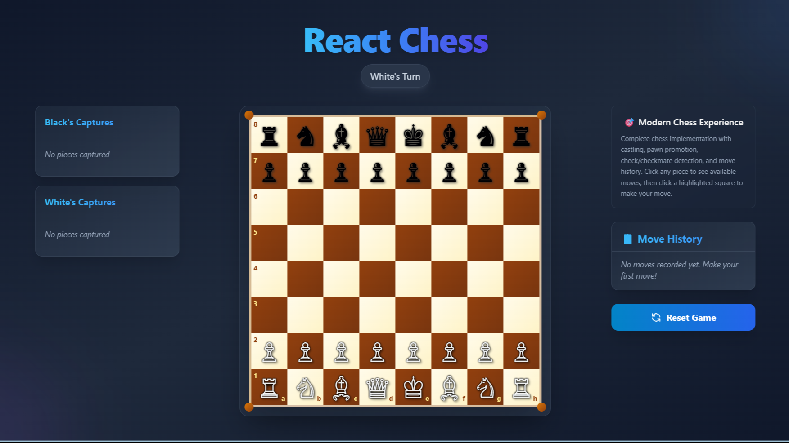

# ♟️ React Chess Game

A beautiful, modern chess game built with React, TypeScript, and Tailwind CSS. Features a complete chess implementation with stunning visuals and smooth animations.



## ✨ Features

### 🎮 Complete Chess Implementation
- **Full Chess Rules**: All standard chess moves including castling, pawn promotion, en passant
- **Check & Checkmate Detection**: Real-time game state analysis
- **Stalemate Recognition**: Proper draw conditions
- **Move Validation**: Legal move highlighting and validation
- **Algebraic Notation**: Complete move history with standard chess notation

### 🎨 Modern UI/UX
- **Beautiful Design**: Gradient backgrounds with glass-morphism effects
- **Responsive Layout**: Optimized for desktop, tablet, and mobile devices
- **Smooth Animations**: Piece hover effects and move transitions
- **Visual Feedback**: 
  - Selected piece highlighting with glow effects
  - Possible move indicators (dots for empty squares, corner highlights for captures)
  - Check/checkmate status with animated icons
  - Game state indicators with color-coded badges

### 🔧 Technical Features
- **TypeScript**: Fully typed for better development experience
- **React Hooks**: Modern React patterns with custom hooks
- **Tailwind CSS**: Utility-first styling with custom gradients and effects
- **Accessibility**: ARIA labels and keyboard navigation support
- **Performance**: Optimized rendering and move calculation

## 🚀 Getting Started

### Prerequisites
- **Node.js** (version 16 or higher)
- **npm** or **yarn**

### Installation

1. **Clone the repository**
   ```bash
   git clone <repository-url>
   cd react-tailwind-chess
   ```

2. **Install dependencies**
   ```bash
   npm install
   ```

3. **Start the development server**
   ```bash
   npm run dev
   ```

4. **Open your browser**
   Navigate to `http://localhost:5173` to start playing!

## 🎯 How to Play

1. **Start a Game**: White moves first
2. **Select a Piece**: Click on any of your pieces to see available moves
3. **Make a Move**: Click on a highlighted square to move your piece
4. **Special Moves**:
   - **Castling**: Select your king and click on the castling square
   - **Pawn Promotion**: Pawns automatically promote to Queen when reaching the end
5. **Game End**: The game detects checkmate, stalemate, and check conditions automatically

## 🏗️ Project Structure

```
src/
├── App.tsx                    # Main application component
├── types.ts                   # TypeScript type definitions
├── constants.ts               # Game constants and piece Unicode
├── components/
│   ├── BoardComponent.tsx     # Chess board grid layout
│   ├── SquareComponent.tsx    # Individual square with piece
│   ├── PieceDisplay.tsx       # Chess piece rendering
│   └── NotationDisplay.tsx    # Move history display
└── services/
    └── chessEngine.ts         # Chess logic and move validation
```

## 🎨 Styling Features

- **Amber Wood Theme**: Warm amber colors for a classic chess board feel
- **Gradient Backgrounds**: Multiple layered gradients for depth
- **Glass Morphism**: Backdrop blur effects on UI elements
- **Responsive Typography**: Scales beautifully across all devices
- **Hover Effects**: Interactive piece and square animations
- **Status Indicators**: Color-coded game state with icons

## 🔧 Available Scripts

- `npm run dev` - Start development server
- `npm run build` - Build for production
- `npm run preview` - Preview production build
- `npm run lint` - Run ESLint
- `npm run type-check` - Run TypeScript compiler check

## 🛠️ Built With

- **[React 18](https://reactjs.org/)** - UI framework
- **[TypeScript](https://www.typescriptlang.org/)** - Type safety
- **[Tailwind CSS](https://tailwindcss.com/)** - Styling framework
- **[Vite](https://vitejs.dev/)** - Build tool and dev server

## 🎯 Future Enhancements

- [ ] **En Passant** - Special pawn capture rule
- [ ] **Game Timer** - Chess clocks for timed games
- [ ] **Move Undo/Redo** - Navigate through move history
- [ ] **PGN Export/Import** - Save and load games
- [ ] **AI Opponent** - Computer player with difficulty levels
- [ ] **Online Multiplayer** - Play against friends online
- [ ] **Game Analysis** - Move suggestions and analysis
- [ ] **Custom Themes** - Multiple board and piece themes

## 🤝 Contributing

Contributions are welcome! Please feel free to submit a Pull Request. For major changes, please open an issue first to discuss what you would like to change.

1. Fork the project
2. Create your feature branch (`git checkout -b feature/AmazingFeature`)
3. Commit your changes (`git commit -m 'Add some AmazingFeature'`)
4. Push to the branch (`git push origin feature/AmazingFeature`)
5. Open a Pull Request

## 📝 License

This project is licensed under the MIT License - see the [LICENSE](LICENSE) file for details.

## 🙏 Acknowledgments

- Chess piece Unicode characters from Unicode Standard
- Inspiration from classic chess interfaces
- Tailwind CSS community for styling patterns

---

Made with ❤️ and ♟️ by [Your Name]

**Enjoy playing chess! 🎉**
